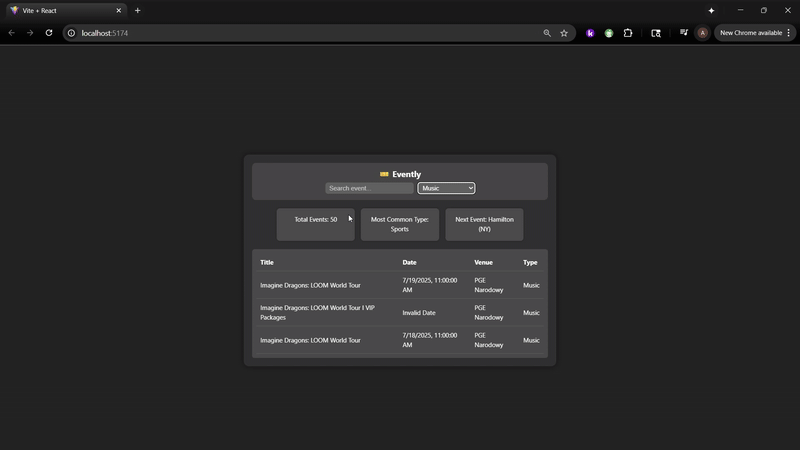

# Web Development Project 5 - *Evently – Your Personalized Event Dashboard*

Submitted by: **Atuh Fon**

This web app: **Evently is a sleek, user-friendly web app that helps you discover and keep track of exciting events happening around you. Powered by the Ticketmaster API, Evently allows users to:**

- Search for concerts, sports games, festivals, and more  
- Filter events by city, date, or category  
- Save and revisit your favorite events  
- Get quick insights with clean visuals and a responsive interface  

Time spent: **6** hours spent in total

## Required Features

The following **required** functionality is completed:

- [x] **The site has a dashboard displaying a list of data fetched using an API call**
  - The dashboard should display at least 10 unique items, one per row
  - The dashboard includes at least two features in each row
- [x] **`useEffect` React hook and `async`/`await` are used**
- [x] **The app dashboard includes at least three summary statistics about the data** 
  - The app dashboard includes at least three summary statistics about the data, such as:
    - *insert details here*
- [x] **A search bar allows the user to search for an item in the fetched data**
  - The search bar **correctly** filters items in the list, only displaying items matching the search query
  - The list of results dynamically updates as the user types into the search bar
- [x] **An additional filter allows the user to restrict displayed items by specified categories**
  - The filter restricts items in the list using a **different attribute** than the search bar 
  - The filter **correctly** filters items in the list, only displaying items matching the filter attribute in the dashboard
  - The dashboard list dynamically updates as the user adjusts the filter

The following **optional** features are implemented:

- [x] Multiple filters can be applied simultaneously
- [x] Filters use different input types
  - e.g., as a text input, a dropdown or radio selection, and/or a slider
- [x] The user can enter specific bounds for filter values

## Video Walkthrough

Here's a walkthrough of implemented user stories:

GIF created with:
- [EzGIF](https://ezgif.com/) for Windows

## Challenges Encountered

1. **.env File Setup**
   - Vite requires environment variables to start with `VITE_` to be accessible in the app. Initially, the API key didn’t load because the key was named incorrectly or not formatted properly.

2. **Ticketmaster API Key Confusion**
   - The Ticketmaster developer portal shows multiple credentials like "Consumer Key" and "Consumer Secret." It wasn’t immediately clear which one to use for API requests, which caused delays in connecting the app.

3. **No Results Showing**
   - Even after connecting the API, no events were showing. This was caused by incorrect query formatting or not handling the API response structure correctly. It required testing and checking the API’s JSON structure in the browser.

4. **Restarting the Dev Server**
   - Changes to the `.env` file weren’t taking effect until the development server was restarted. This wasn’t obvious at first and caused confusion when debugging the API key issue.

## License

    Copyright [2025] [Atuh Fon]

    Licensed under the Apache License, Version 2.0 (the "License");
    you may not use this file except in compliance with the License.
    You may obtain a copy of the License at

        http://www.apache.org/licenses/LICENSE-2.0

    Unless required by applicable law or agreed to in writing, software
    distributed under the License is distributed on an "AS IS" BASIS,
    WITHOUT WARRANTIES OR CONDITIONS OF ANY KIND, either express or implied.
    See the License for the specific language governing permissions and
    limitations under the License.
